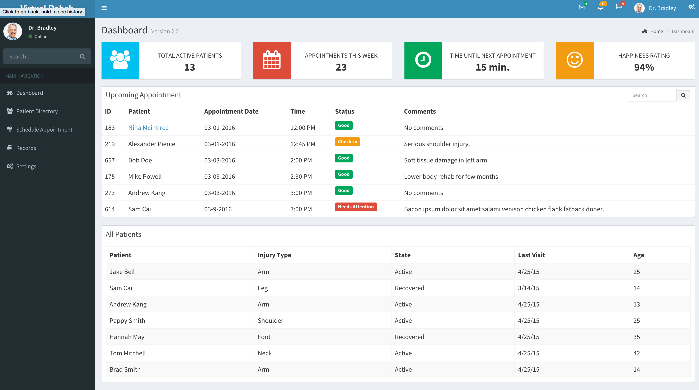
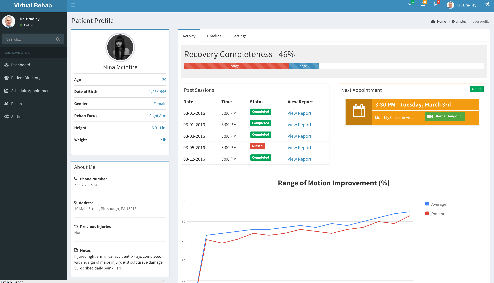
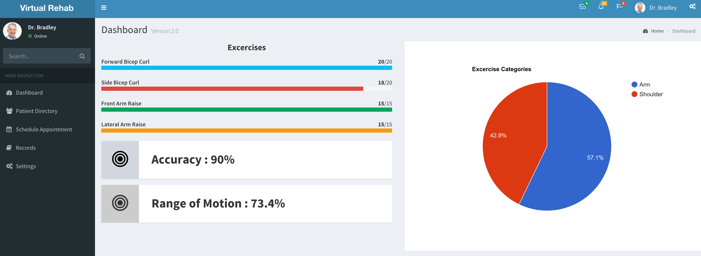

# Virtual Rehab Platform
#### Mylan Hackathon Pittsburgh - 1st place

Millions of people across the world don’t have the proper access to rehabilitation services which they need due 
to constraints such as limited mobility or geographical barriers.

Our solution uses the XBOX kinect to allow patients to perform rehab excercises from the comfort of their home. 
This Django platform allows the doctor to maintain communication with their patients and analyze the results of their
excercises with the XBOX kinect to guide them through their journey to recovery. 

* A dashboard that allows doctors to view all of his patients




* View of patient profile for the doctor to monitor the progress of each patient



* Detailed report and analysis of each session any patient has conducted with the Kinect




And its current `requirements.txt` file is:

```
Django==1.9.2
django-bootstrap3==7.0.0
wheel==0.24.0
```

## Installation

### 1. virtualenv / virtualenvwrapper
Create [virtualenv](http://www.virtualenv.org/) for your own project, where `projectname` is the name of your project:

Install virtualenv via pip:

`$ pip install virtualenv`

1. Create a virtual environment for a project:
  ```
 $ virtualenv projectname
```
 
2. To begin using the virtual environment, it needs to be activated:
   ```
  $ cd projectname
  $ source bin/activate
```


### 2. Download
Now, you need the *django-polls-app* project files in your workspace:

    $ cd /path/to/your/workspace
    $ git clone git://github.com/kishan/Django-Polls-App.git polls_app
    $ cd polls_app

### 3. Requirements
Right there, you will find the *requirements.txt* file that has all the great debugging tools, django helpers and some other cool stuff. To install them, simply type:

`$ pip install -r requirements.txt`

### 4. Initialize the database

`python manage.py migrate`

### 5. Runserver

`python manage.py runserver`


######Notes
* more widgets can be found from https://github.com/almasaeed2010/AdminLTE
